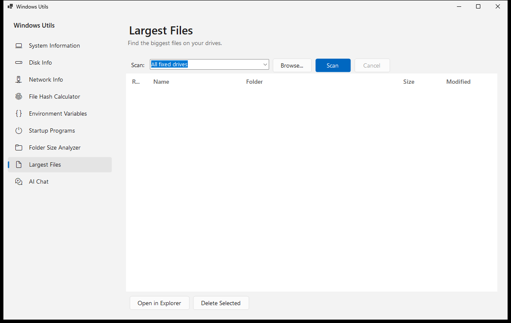
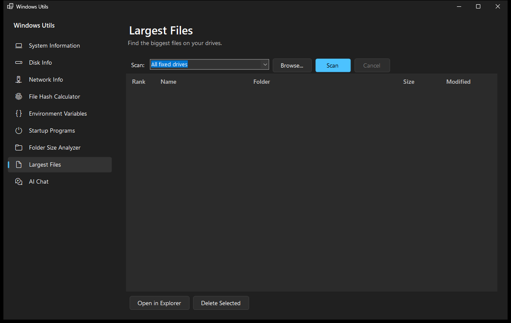
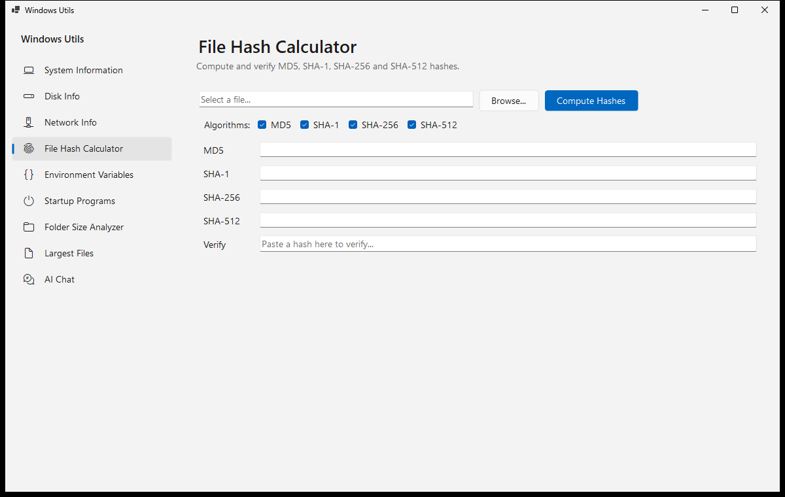
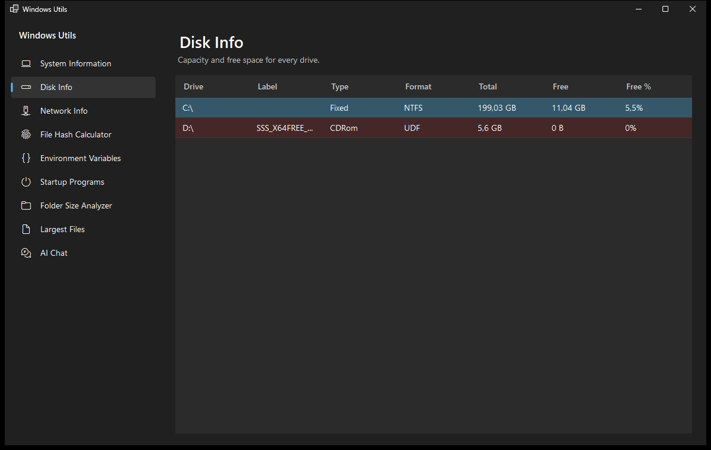

# WindowsUtils

A Windows Forms app (.NET 10) that bundles small, handy Windows utilities in a single window with sidebar navigation. Reusable logic (hashing, file scanning, formatting) lives in the dependency-free `WindowsUtils.Core` class library, usable from any .NET app.

The UI follows the Windows 11 look: it switches between light and dark with your Windows setting and uses your Windows accent color.

## Screenshots

| Light | Dark |
| --- | --- |
|  |  |
|  |  |

## Utilities

| Utility | What it does |
| --- | --- |
| **System Information** | OS, CPU, RAM usage, uptime, screen resolution |
| **Disk Info** | All drives with total/free space; highlights drives under 10% free |
| **Network Info** | Adapters, IPs, MAC addresses + built-in ping tool |
| **TCP Traceroute** | Trace the network path to a host over TCP, hop by hop (needs Administrator) |
| **File Hash Calculator** | MD5 / SHA-1 / SHA-256 / SHA-512 with hash verification |
| **Environment Variables** | Browse User / Machine / Process variables |
| **Startup Programs** | Programs registered to start with Windows (registry Run keys) |
| **Folder Size Analyzer** | Sizes of everything inside a folder, sorted largest first |
| **Largest Files** | Scans drives/folders for the top 100 largest files; open in Explorer or delete to Recycle Bin |
| **AI Chat** | Chat with an AI agent that can inspect this PC via read-only tools (needs an API key) |

## Requirements

- Windows
- [.NET 10 SDK](https://dotnet.microsoft.com/download) to build from source

## Build & run

```powershell
dotnet build
dotnet run --project WindowsUtils
```

## Single-file build

Both options produce one `WindowsUtils.exe` in `WindowsUtils\bin\Release\net10.0-windows\win-x64\publish\`.

### Option A: Self-contained (~50 MB, recommended)

Includes the .NET runtime, so the target machine needs **nothing** else installed.

```powershell
dotnet publish WindowsUtils -c Release -r win-x64 --self-contained `
    -p:PublishSingleFile=true `
    -p:IncludeNativeLibrariesForSelfExtract=true `
    -p:EnableCompressionInSingleFile=true
```

### Option B: Framework-dependent (~0.2 MB)

Much smaller, but the target machine must already have the [.NET 10 runtime](https://dotnet.microsoft.com/download) installed.

```powershell
dotnet publish WindowsUtils -c Release -r win-x64 --self-contained=false `
    -p:PublishSingleFile=true
```

> **Note on trimming:** .NET trimming (`PublishTrimmed`) is currently **not supported** for Windows Forms apps; the SDK blocks it with `NETSDK1175`. This is why the self-contained build still bundles the full runtime.

## Project structure

```
WindowsUtils.Core/       # reusable class library (net10.0, zero dependencies)
├── Hashing/FileHasher.cs # file hashing + verification
├── ByteFormatter.cs      # human-readable byte sizes
└── IO/FileScanner.cs     # top-N largest files, directory sizes
WindowsUtils.AI/         # AI chat logic (net10.0): agent session, PC tools, settings, credentials
├── ChatSession.cs        # agent creation, streaming, reasoning-effort handling
├── PcTools.cs            # read-only PC inspection tools for the agent
├── ChatSettingsStore.cs  # persisted endpoint/model settings
└── CredentialStore.cs    # API key in Windows Credential Manager
WindowsUtils/            # WinForms app (net10.0-windows)
├── Program.cs            # entry point
├── MainForm.cs           # shell: sidebar navigation + content host
├── Theme.cs              # Windows 11 style colors, fonts, light/dark mode, accent color
└── Utilities/
    ├── UtilityControl.cs # base class with shared grid/format helpers
    └── *Control.cs       # one self-contained UserControl per utility
```

Adding a new utility = one new file in `Utilities/` + one line in `MainForm.Utilities`. See [AGENTS.md](AGENTS.md) for conventions and gotchas.
